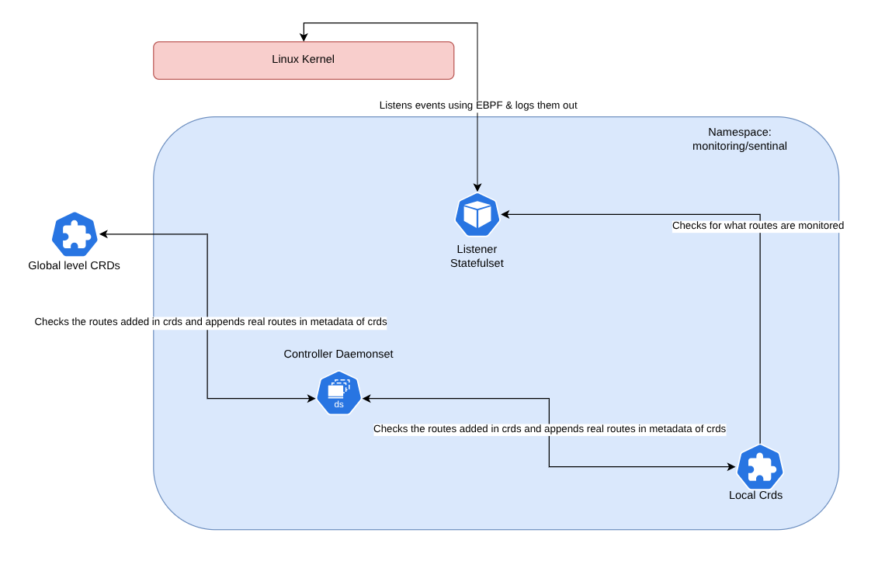

# Architecture



## Daemonset

* This will be golang code which will query into cgroup using k8s api and would bring in the actual path of file instead of regex
* These path will be added into CRDs itself. Piece by Piece they will be added
* Whenever their is rename or delete event then these paths will be changed accordingly by StatefulSet

## StatefulSet

* This is where we insert kprobes into the kernel
* It will listen to the ebpf logs and print them
* They can be eventually be recorded by loki and can be seen in grafana
* It can also modify crds whenever there is delete or rename event

## CRDs

These CRDs can be like

These CRDs will be used by daemonset to send information to ebpf program in the linux kernel

Regex to be used exclusively

They can be in different namespace as it will be applied on pods that are there

We can have a global monitoring policy as well

We can add dirs as well as depth (How many levels of depth to scan files for?) to it if we don't want to overload the system

```yaml
apiVersion: sentinelfs.io/v2
kind: FileMonitoringPolicy
metadata:
  name: monitor
spec:
  podSelector:
    labels:
      - key: app
        value: pipeline
  dirs:
    - path: /app/*
      depth: 4
  files:
    - path: /etc/sample.txt
      cGroupId: abc123
      inode: 456789
    - path: /app/main.py
      cGroupId: ghi789
      inode: 123456
```
